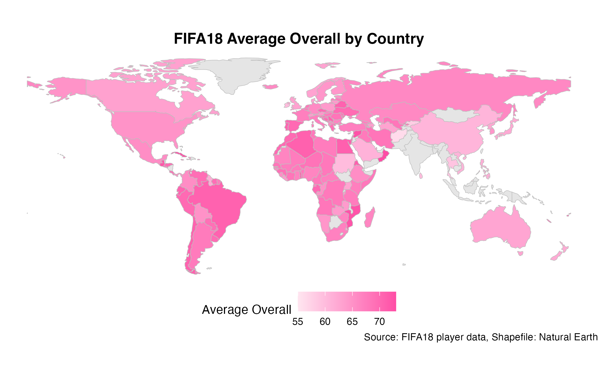

# Data Visualization and Reproducible Research

> Katelyn Bailey

The following is a sample of products created during the _"Data Visualization and Reproducible Research"_ course.

## Project 01

In the `project_01/` folder, you can find my first mini project, where I explored temporal patterns in U.S. birth data from 2000 to 2014. The visualizations provide insights into births by days on a weekly, monthly, and yearly level, as well as seasonal patterns. Exploratory visualizations included bar charts and a stacked bar chart of 'Total Births by Day of the Week,' 'Total Births by Month,' and 'Proportion of Births on Days of the Week by Month,' respectively. Additionally, I examined 'Daily Births Over Time,' 'Smoothed Time Trends of Daily Births by Year,' and 'Births by Month and Day of the Week' through scatterplots and a dot matrix.  
  
**Sample data visualization:** 

All visualizations, full code, and the report can be found in the 'project_01/' folder. 

## Project 02

In this mini project, I explored the FIFA18 dataset, where I looked at patterns in how age, potential, and physical traits influence player ratings, while also highlighting national trends in player distribution across the world. I used an interactive scatterplot, spatial maps of the world, and a model based coefficient graph to visualize any insights. 

**Sample data visualization:** 

All visualizations, full code, and the report can be found in the 'project_02/' folder. 

## Project 03

In this project, I visualized weather data in Tampa, FL during 2022 through faceted histograms and density plots, ridges, and a heatmap. I looked at temporal relationships with temperatures and precipitation. Then, I used histograms, boxplots, scatterplots, and a bubble chart to visualize cement data. I explored comprehensive strength of concrete in relation to age, water, and cement contents. 

**Sample data visualization:** 

All visualizations, full code, and the report can be found in the 'project_03/' folder. 

### Moving Forward
Throughout this course, I learned that even simple plots, when implemented thoughtfully, can tell meaningful stories. Going forward, I want to continue exploring how to design reproducible data workflows and apply storytelling techniques to better communicate findings to both technical and non-technical audiences. I especially enjoyed learning about the different types of data visualizations and how to use aesthetics — not just to make charts prettier, but to present data more meaningfully. Learning about Git and version control was definitely valuable, and it's a skill I’d like to continue building as I grow more confident in collaborative, code-based projects. 
